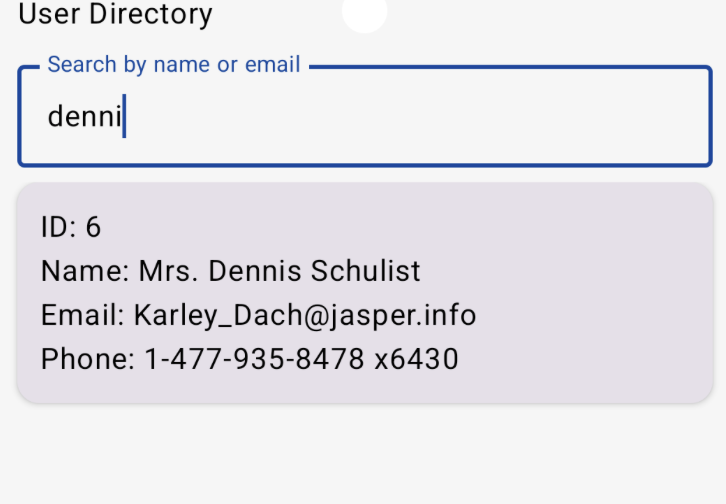
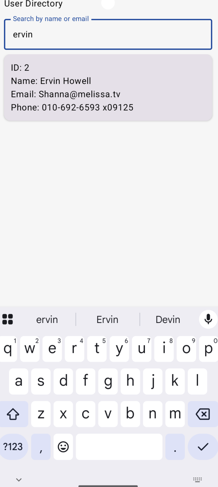
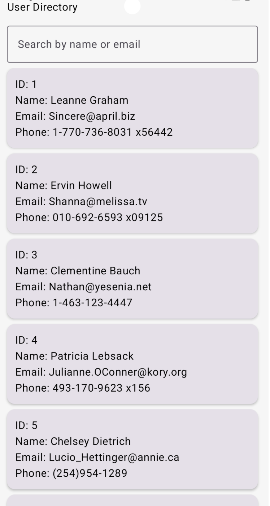

# User Directory App (Jetpack Compose + Room + Retrofit + MVVM)

A simple Android app that displays a list of users from the JSONPlaceholder API.
The app fetches users from the network using Retrofit + Moshi, saves them locally
using Room, and displays cached DB data using Jetpack Compose and StateFlow 
(MVVM architecture).

### ✨ Features
- 🚀 Fetch users from API (https://jsonplaceholder.typicode.com/users)
- 💾 Caches users locally using Room Database
- 🔄 Auto-refresh on launch + manual refresh
- 🔍 Search users by name or email
- 🧱 Clean architecture (Repository + DAO + DTO + MVVM)
- 🎨 Jetpack Compose UI

---

## 🛠 Tech Stack

| Layer | Library |
|------|----------|
| UI | Jetpack Compose, Material3 |
| State | ViewModel + StateFlow |
| Network | Retrofit2 + Moshi + OkHttp3 Logging |
| Database | Room ORM |
| DI | Manual (ServiceLocator) |
| Language | Kotlin |

---

## 🚀 How It Works

### 1. App Starts → ViewModel calls `refreshUsers()`
### 2. Repository makes API call:
- Retrofit fetches user list
- Converts JSON → Kotlin data classes using Moshi
- Saves users to Room database

### 3. UI Observes Room
flow → StateFlow → Compose UI updates

### 4. Search Filters
SELECT * FROM users WHERE name LIKE %query% OR email LIKE %query%

---

## 🔧 API
GET https://jsonplaceholder.typicode.com/users

---

## ▶️ Run the App

1. Open Android Studio
2. Sync Gradle
3. Run on emulator or physical device

---

## Screenshots

---

## 📦 Build Requirements
- Android Studio Koala or newer
- Min SDK 24+
- Kotlin 1.9+
- Compose BOM 2024+
- Retrofit2 + Moshi

---

## 💬 Author
Indrayani Bhosale
